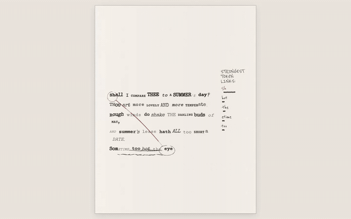

# Font Attention

Font Attention is a design-engineering experiment that translates transformer attention into variable typography. A recorded pass from **Qwen3-0.6B** drives the weight, width, slant, and optical-size axes of Roboto Flex while the interface exposes the strongest token-to-token links.

**[Open the live interactive replay](https://boning1011.github.io/font-attention/)**

The current demo uses the opening quatrain of Shakespeare's *Sonnet 18*. It is a teacher-forced replay of real attention tensors—not a simulation and not a claim that the model authored the text.



## What it explores

- **LLM interpretability as visual material** — model attention becomes legible motion, emphasis, and connection.
- **Variable typography as a data display** — four font axes respond to focus, entropy, and self-attention.
- **Motion as contextual disturbance** — each incoming token springs into place, triggers sympathetic pops, and sends a short axis oscillation through selected earlier tokens; older words settle until an attention-linked ripple reaches them.
- **Design engineering in the browser** — the visualization, transport controls, and inspector are implemented as a lightweight static web app.
- **Reproducible model-to-interface pipeline** — a Python exporter converts local model tensors into compact JSON; the deployed site needs no model server or API key.

## Run the interface

```bash
npm install
npm run dev
```

Create a production build with `npm run build`. The repository includes a GitHub Pages workflow, and the site has no runtime secrets or backend dependency.

## Regenerate the attention replay

Create a Python environment with PyTorch and Transformers, then run:

```bash
python -m pip install -r requirements-model.txt
python scripts/export_attention_replay.py
```

The exporter defaults to `Qwen/Qwen3-0.6B`, runs on CUDA when available, averages every head in the final four transformer layers, and writes `public/data/qwen3-sonnet-18.json`. A different model or text can be supplied with `--model` and `--text`.

## Mapping

| Attention signal | Typographic axis |
| --- | --- |
| Maximum attention / focus | Weight (`wght`) |
| Normalized attention entropy | Width (`wdth`) |
| Self-attention | Slant (`slnt`) |
| Inverse entropy | Optical size (`opsz`) |

This mapping is an expressive design decision, not an analytical claim about model cognition.

The motion layer preserves the behavior developed in the early prototype—spring entrance, sympathetic pops, selective disturbance, decaying oscillation, stability, and occasional ripples—while replacing its mock attention driver with the recorded Qwen3 tensor data.

## Stack

Qwen3 · PyTorch · Hugging Face Transformers · JavaScript · SVG · CSS variable fonts · Vite

## License

Source code is available under the MIT License. Shakespeare's *Sonnet 18* is in the public domain.
